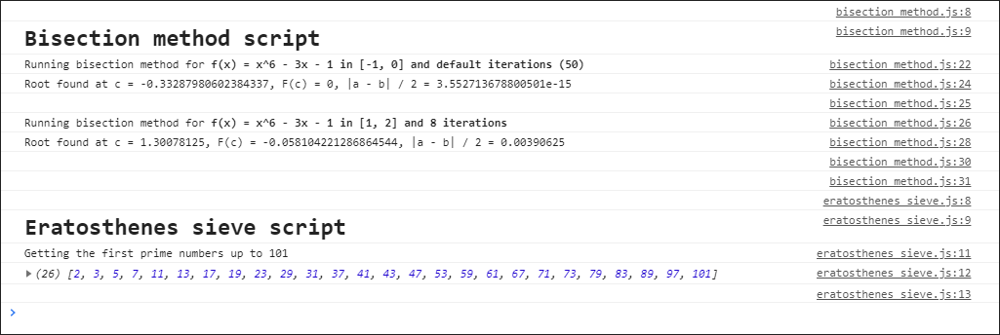

# Example Project: Miscellaneous computations in JS

&nbsp;

Example project where I compute miscellaneous problems of applied math.

The scripts are about:

- **bisection-method.mjs:** Computes the root of a polynomial according to the bisection method.
  Basic implementation I made in 2016 to run the algorithm. See
  also: [Example Project: Secant Method](https://github.com/tobiasbriones/ep-secant-method).

- **eratosthenes-sieve.mjs:** Computes prime numbers by using the eratosthenes sieve algorithm.
  Basic implementation I made in 2016 to run the algorithm.

## Getting started

Run [index.html](./src/index.html) into a web server to check the results. For example, `http-server .\src\`.

Run the tests with `npm run test`.

## Screenshots

## Contact

This project: [GitHub Repository](https://github.com/tobiasbriones/ep-misc-computations-in-js)

Tobias Briones: [GitHub](https://github.com/tobiasbriones)

Example Project: [App](https://tobiasbriones.github.io/example-project)

## About

**Example Project: Miscellaneous computations in JS**

Example project where I compute miscellaneous problems of applied math.

Copyright © 2019-2020 Tobias Briones. All rights reserved.

### License

This project is licensed under the [MIT License](./LICENSE).
